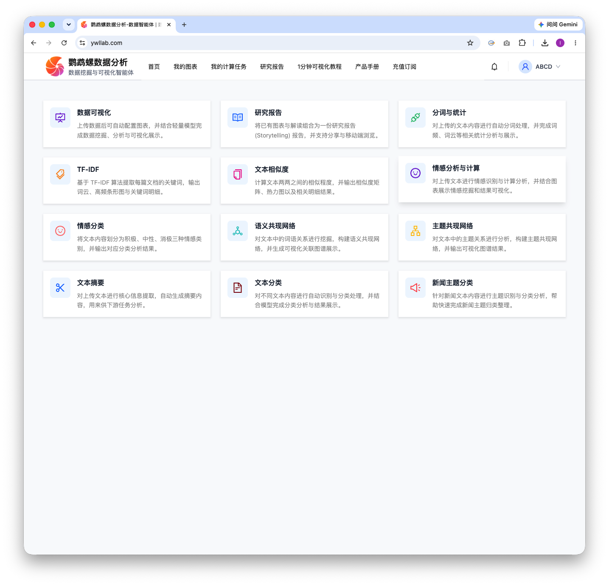
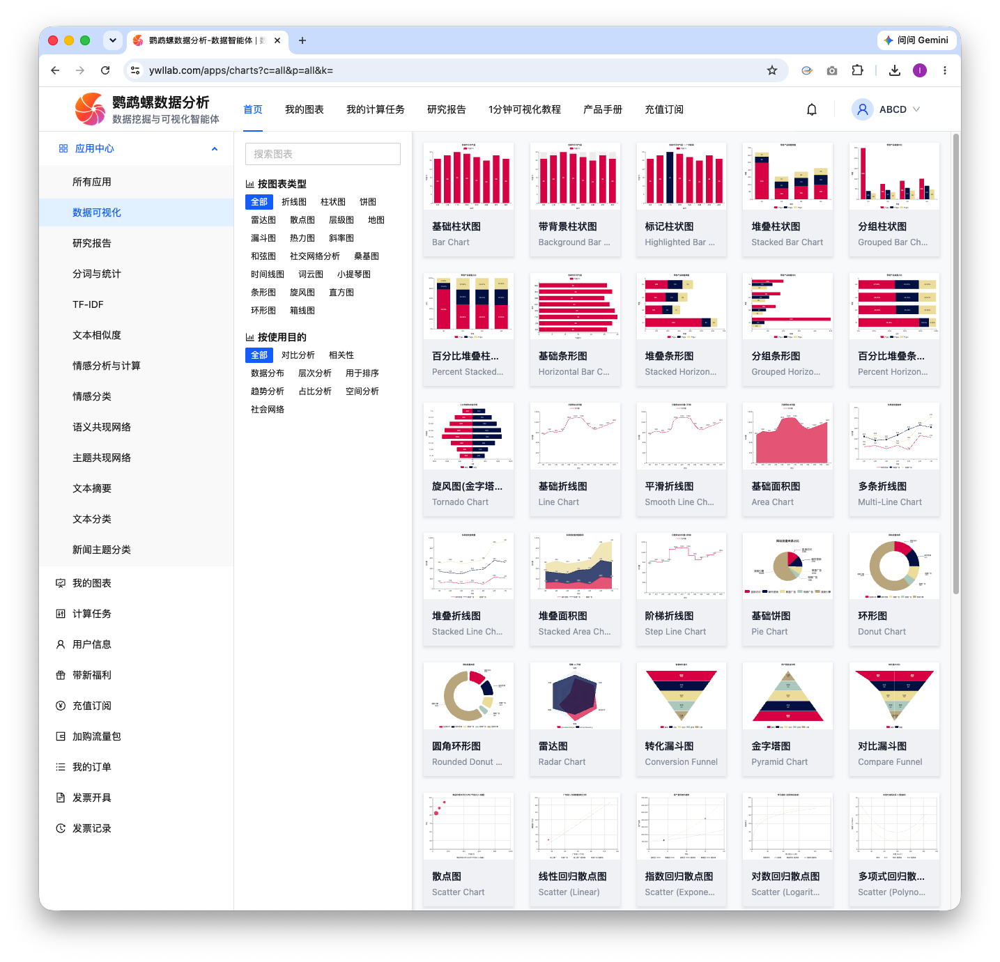
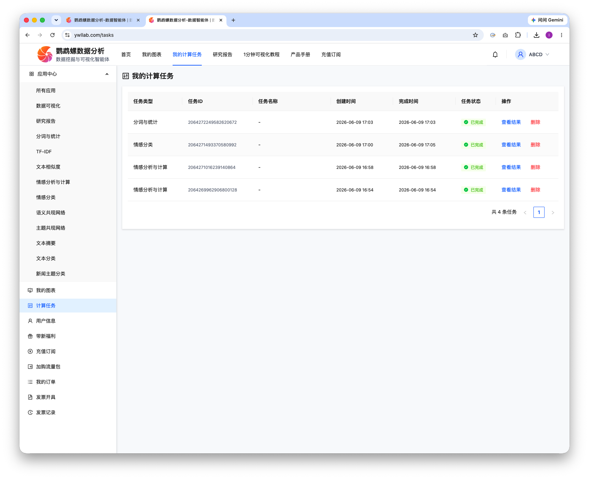
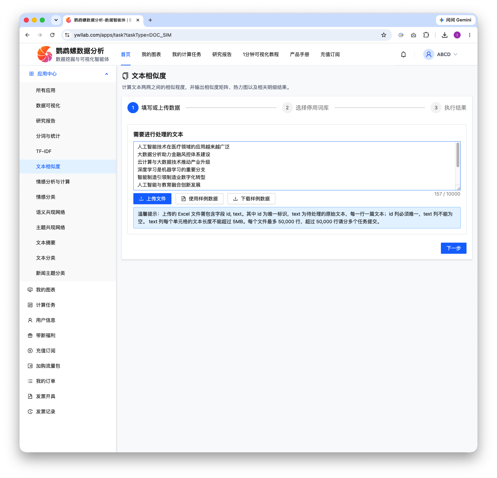
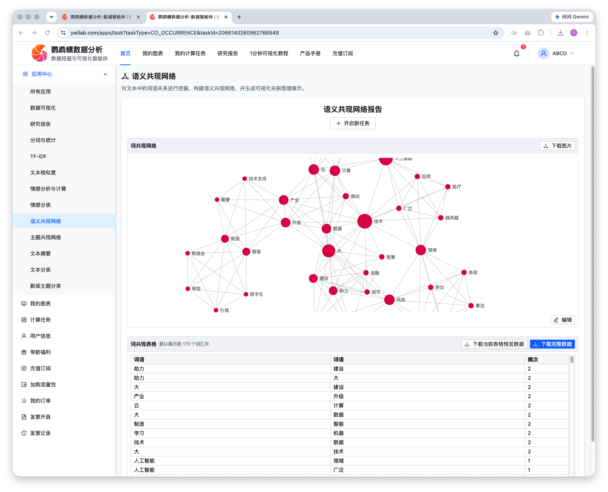
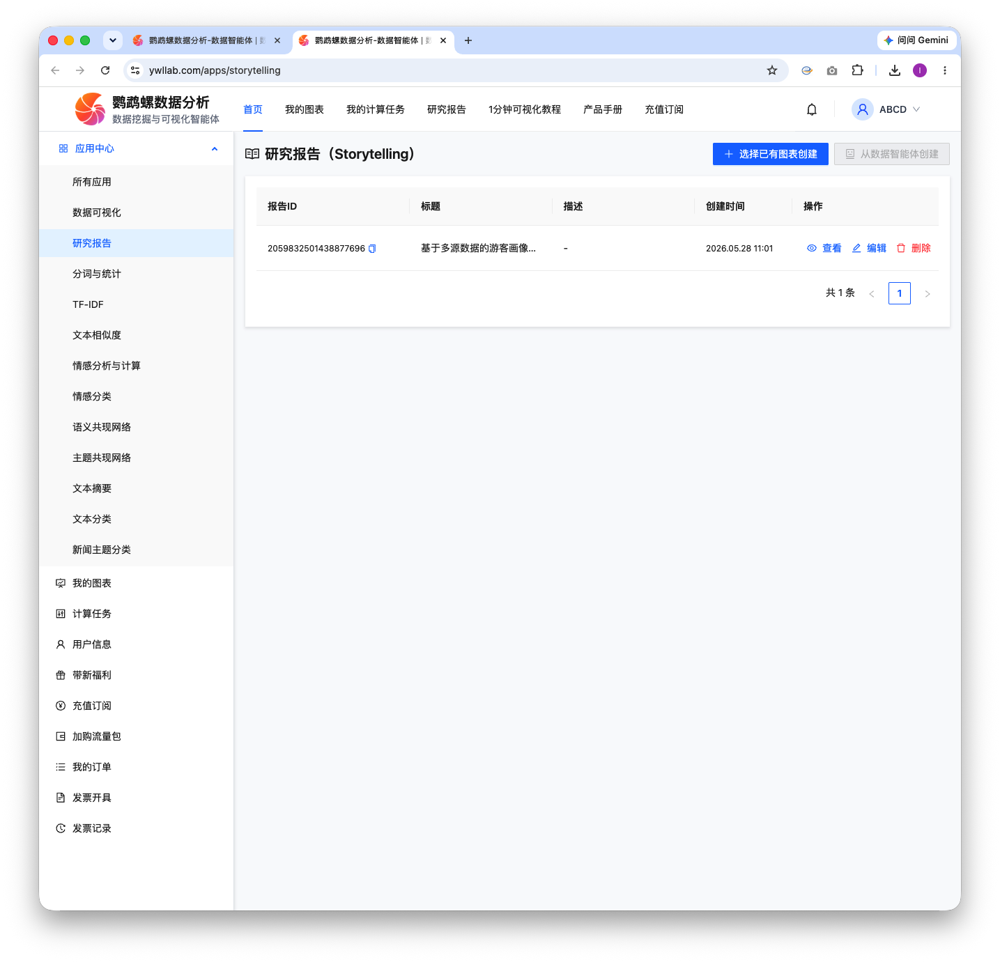

# Nemo 数据分析 

数据可视化分析与数据挖掘平台，为企业数据分析团队、科研团队提供高效的数据分析与数据洞察。

## 技术栈

| 端       | 技术                                               |
|---------|--------------------------------------------------|
| 前端（用户端） | React + TypeScript + Vite + Ant Design + ECharts |
| 前端（管理端） | React + TypeScript + Vite + Ant Design           |
| 后端      | Kotlin + Spring Boot + MySQL           |
| 算法端     | Python + FastAPI + LLMs           |

## 项目结构

```
Nemo/
├── backend/           # 后端服务 (Spring Boot + Kotlin)
├── frontend/          # 前端应用 - 用户端
├── frontend-boss/    # 前端应用 - 运营管理端（UI相关基本是Code Agent生成）
├── docs/             # 项目文档 (需求/设计/架构/API/开发)
├── Makefile          # 构建和部署命令
├── .cicd/            # CI/CD 部署脚本
└── .github/          # GitHub Actions 工作流配置
```

## 环境要求

- Node.js >= 18  
- JDK >= 17   
- MySQL >= 8.0   
- pnpm >= 8   
- 需要在对应的项目配置OSS路径，可以参考：.cicd/docker/land/README.MD 以及配置frontend/.env.production。


## 效果截图
| 图片 |
|---|
| <br>图 1：主页|
| <br>图 2：图表可视化 |
| <br>图 3：我的计算任务 |
| <br>图 4：文本相似度 |
| <br>图 5：语义共现网络 |
| <br>图 6：数据报告 |


## 数据可视化体验（纯前端）    
没有部署Land机器学习、LLM和后端服务，因此仅提供前端可视化（[Hi Data ](https://vczero.github.io/hidata/)）。用户可以在浏览器中操作Excel进行可视化。   

如果只是将输出的结果进行可视化，完全可以在 [Hi Data ](https://vczero.github.io/hidata/)上完成，数据不会传输到远程服务器，仅在浏览器中操作。如需完整的计算任务和数据挖掘，则需要部署整个项目到自己的服务器。

## Nemo Team  

<table>
  <tr>
    <td align="center">
      <a href="https://github.com/vczero">
        
        <br />
        <b>vczero</b>
      </a>
      <br />
      Product Architecture & Algorithms
    </td>
    <td align="center">
      <a href="https://github.com/snoozybot">
        
        <br />
        <b>snoozybot</b>
      </a>
      <br />
      Frontend & Data Agent
    </td>
    <td align="center">
      <a href="https://github.com/geosmart">
        
        <br />
        <b>geosmart</b>
      </a>
      <br />
      Backend & Data Agent
    </td>

 <td align="center">
      <a href="">
        
        <br />
        <b>Joe</b>
      </a>
      <br />
      Product Experience & Testing
    </td>
    
  </tr>
</table>

